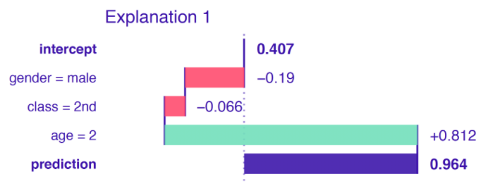
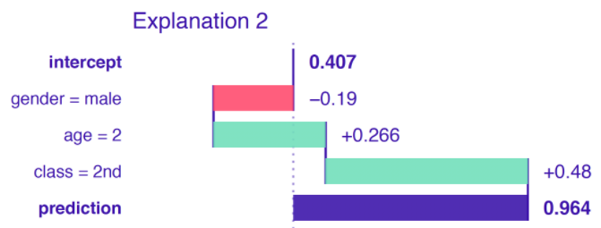

# DALEX

With the increasing demand for predictive models, model properties such as flexibility, capability of internal variable selection or feature engineering, and high precision of predictions are of interest. To obtain robust models, ensembles of models are used. Techniques like bagging, boosting, or model stacking combine hundreds or thousands of simpler models into one super-model. Large deep-neural models may have over a billion of parameters.

**_3 Requirements Predictive Models should fufill_**
- **Prediction Validation:** For every prediction of a model, one should be able to verify how strong is the evidence that supports the prediction.
- **Prediction’s justification:** For every prediction of a model, one should be able to understand which variables affect the prediction and to what extent.
- **Prediction’s speculation:** For every prediction of a model, one should be able to understand how the prediction would change if the values of the variables included in the model changed.

**Model-Specific Approaches**
- Linear models: Model Assumptions formally defined by _(normality, linear structure, homogeneity of variance)_ can be checked by _normality test plots_
- Random Forrest Models: Are equipped with the OOB method of evaluating performance and several tools for measuring variable importance. Methods have been developed to extract information about possible interactions from the model structure (Paluszynska and Biecek 2017; Ehrlinger 2016)

---

## Model Development
> - **Explanatory Modeling:** models are applied for inferential purposes, i.e., to test hypotheses resulting from some theoretical considerations related to the investigated phenomenon (for instance, related to an effect of a particular clinical factor on a probability of a disease).
- **Predictive modeling:** models are used for the purpose of predicting the value of a new or future observation (for instance, whether a person has got or will develop a disease).

---

## Explainer

#### Function

name | description | variables
--- | --- | ---
explain() | object that provides an uniform interface for different models | data, y, predict_function, residula_function, verbose, model_info, type, label

---

# Instance-Level
> Understand how a model yields a prediction for a particular single observation. We may consider the following situations as examples:
- Evaluate effects of explanatory variables on the model’s predictions
- How would the model’s predictions change if values of some of the explanatory variables changed
- We may discover that the model is providing incorrect predictions, and we may want to find the reason

## Break-Down Plots:
> _which variables contribute to this result the most ?_

### Break-Down "Interactions"

 “variable attributions”, i.e., the decomposition of the model’s prediction into contributions that can be attributed to different explanatory variables.

**INTUITION**

Assume that prediction **f(x)** is an approximation of the expected value of the dependent variable **Y** given values of explanatory variables **x**. The underlying idea of BD plots is to capture the contribution of an explanatory variable to the model’s prediction by computing the shift in the expected value of  
**Y**, while fixing the values of other variables.

We first consider the explanatory variables gender, class, and age, in that order. Figure 6.2 indicates negative contributions for the first two variables and a positive contribution for the third one. Thus, the fact that the passenger was a boy decreases the chances of survival, as compared to the mean model-prediction. He travelled in the second class, which further lowers the probability of survival. However, as the boy was very young, this substantially increases the odds of surviving. This last conclusion is the result of the fact that most passengers in the second class were adults; therefore, a kid from the second class had higher chances of survival.

We now consider the following order of explanatory variables: gender, age, and class. Figure 6.2 indicates a positive contribution of class, unlike in the first explanation. Again, the fact that the passenger was a boy decreases the chances of survival, as compared to the mean model-prediction. However, he was very young, and this increases the probability of survival as compared to adult men. Finally, the fact that the boy travelled in the second class increases the chance even further. This last conclusion stems from the fact that most kids travelled in the third class; thus, being a child in the second class would increase chances of survival.

#### METHOD

**Linear Models**

Assume the classical linear-regression model for dependent variable **Y** with **p** explanatory variables, the values of which are collected in vector **x**, and vector **β**
of **p** corresponding coefficients. Prediction for **Y** is given by the expected value of **Y** conditional on **x**. In particular, the expected value is given by the following linear combination:

Assume that we select a vector of values of explanatory variables. We are interested in the contribution of the j-th explanatory variable to model’s prediction **f(x∗)**
for a single observation described by **x∗**.

**General Case**

let **v(j,x∗)** denote the variable-importance measure of the j-th variable and instance
**x∗**, i.e., the contribution of the j-th variable to the model’s prediction at **x∗**.

#### PROS & CONS
**Pros**
- Model-Agnostic can be applied to any predictive model that returns a single number for a single observation
- Easy to understand
**Cons**
- misleading for models including interactions
- choice of ordering of the explanatory variables is important
- only suitable for models with a small or moderate number of explanatory variables

### Shapley Additive Expanations (SHAP)
> averaging the value of a variable’s attribution over all (or a large number of) possible orderings

**INTUITION**

#### METHOD
Let us consider a permutation **J** of the set of indices {1,2,…,p} corresponding to an ordering of **p** explanatory variables included in the model **f()**

#### PROS & CONS
**Pros**
- uniform approach to decompose a model’s predictions into contributions that can be attributed additively to different explanatory variables.

**Cons**
- provide additive contributions (attributions) of explanatory variables. If the model is not additive, then the Shapley values may be misleading.
- for large models, the calculation of Shapley values is time-consuming.
- only suitable for models with a small or moderate number of explanatory variables

### Local Interpretable Model-Agnostic Explanations (LIME)
> The key idea behind it is to locally approximate a black-box model by a simpler glass-box model, which is easier to interpret.

**INTUITION**

We want to understand the factors that influence a complex black-box model around a single instance of interest. To understand the local behavior of the complex model around the point of interest, we generate an artificial dataset, to which we fit a glass-box model. We can fit a simpler glass-box model to the artificial data so that it will locally approximate the predictions of the black-box model. The most typical choices are regularized linear models like LASSO regression or Decision Trees. Both lead to sparse models that are easier to understand. The important point is to limit the complexity of the models, so that they are easier to explain.

### PROS & CONS

**Pros**
- offers an interpretable representation, because the original data space is transformed (for instance, by replacing individual pixels by superpixels for image data) into a more interpretable, lower-dimension space
- provides local fidelity, i.e., the explanations are locally well-fitted to the black-box model.

**Cons**
- there have been various proposals for finding interpretable representations for continuous and categorical explanatory variables in case of tabular data. The issue has not been solved yet. This leads to different implementations of LIME, which use different variable-transformation methods and, consequently, that can lead to different results.
- because the glass-box model is selected to approximate the black-box model, and not the data themselves, the method does not control the quality of the local fit of the glass-box model to the data. Thus, the latter model may be misleading.
- high-dimensional data, data points are sparse. Defining a “local neighborhood” of the instance of interest may not be straightforward. Importance of the selection of the neighborhood is discussed, for example, by Alvarez-Melis and Jaakkola (2018). Sometimes even slight changes in the neighborhood strongly affect the obtained explanations.

## Ceteris-paribus Profiles "other things held constant"
> show how a model’s prediction would change if the value of a single exploratory variable changed

**INTUITION**

### METHOD
**Continuous**

**Categorical**

### PROS & CONS

**Pros**
- One-dimensional CP profiles, as presented in this chapter, offer a uniform, easy to communicate, and extendable approach to model exploration
- easy to compare, as we can overlay profiles for two or more models to better understand differences between the models.
- Can also compare two or more instances to better understand model-prediction’s stability.
- CP profiles are also a useful tool for sensitivity analysis

**Cons**
- One of the most important ones is related to the presence of correlated explanatory variables. For such variables, the application of the ceteris-paribus principle may lead to unrealistic settings and misleading results, as it is not possible to keep one variable fixed while varying the other one.
- A somewhat similar issue is related to the presence of interactions in a model, as they imply the dependence of the effect of one variable on other one(s). Pairwise interactions require the use of two-dimensional CP profiles that are more complex than one-dimensional ones. Needless to say, interactions of higher orders pose even a greater challenge.

### Oscillations

#### METHOD

#### PROS & CONS

**Pros**
- By using the average of oscillations, it is possible to select the most important variables for an instance prediction. This method can easily be extended to two or more variables.

**Cons**
-  the oscillations may not be of help in situations when the use of CP profiles may itself be problematic (e.g., in the case of correlated explanatory variables or interactions – see Section 10.5). An important issue is that the CP-based variable-importance measures (11.1) do not fulfil the local accuracy condition (see Section 8.2), i.e., they do not sum up to the instance prediction for which they are calculated, unlike the break-down attributions (see Chapter 6) or Shapley values (see Chapter 8).

#### Functions  

name | description | variables
--- | --- | ---
predict_parts() | decomposes model predictions into parts that can be attributed to individual variables | explainer, new_observation, **type**[shap, oscillations, break_down_interactions], B _(random_orderings)_
predict_surrogate() | description | explainer, new_observation, type, n_features, n_permutations
predict_profile() | description | explainer, new_observation,

---

# Dataset-Level

## Model-Performance
> Goodness-of-fit / Goodness-of-prediction
- Model Evaluation: how good is the model _(how reliable are the model predictions)_
- Model Comparison: compare two or more models in order to choose between them.
- Out-of_Sample and Out-of-Time Comparison: we may want to check a model’s performance when applied to new data to evaluate if performance has not worsened

**INTUITION**
- **Calibration:** The extent of bias in predicted values, i.e., the mean difference between the predicted and true values.
- **Discrimination:** The ability of the predictions to distinguish between individual true values.

### Continuous Dependent Variable
**Goodness-Of-Fit:**

Mean Squared Error:

Root Mean Squared Error:

R Squared:

### Binary Dependent Variable
**Goodness-Of-Fit**

Briar Score:

 - 0 = Perfect Model
 - 0.25 = Unimformative Model

Log-Likelihood:

**Goodness-Of-Prediction**

Accuracy:

Precision:

-  _useful when the penalty for commiting the Type I is HIGH_

Recall:

F1:

Lift:

#### PROS & CONS

## Variable-Importance Measeures
> - Model Simplification: variables that do not influence a model’s predictions may be excluded from the mode
- Model Exploration: comparison of variables’ importance in different models may help in discovering interrelations between the variables. Also, the ordering of variables in the function of their importance is helpful in deciding in which order should we perform further model exploration
- Domain-knowledge-based model validation: identification of the most important variables may be helpful in assessing the validity of the model based on domain knowledge.
- Knowledge generation: identification of the most important variables may lead to the discovery of new factors involved in a particular mechanism.
- Model Specific / Model-Agnostic

**INTUITION**

Measure how much does a model’s performance change if the effect of a selected explanatory variable, or of a group of variables, is removed? To remove the effect, we use perturbations, like resampling from an empirical distribution or permutation of the values of the variable.

### METHOD

### PROS & CONS

**Pros**
- model-agnostic approach to the assessment of the influence of an explanatory variable on a model’s performance
- measures can be compared between models and may lead to interesting insights

**Cons**
- main disadvantage of the permutation-based variable-importance measure is its dependence on the random nature of the permutations. As a result, for different permutations, we will, in general, get different results. Also, the value of the measure depends on the choice of the loss function **L()**. Thus, there is no single, “absolute” measure.

## Partial-Dependence-Profiles
> Show how the expected value of model prediction behave as a function of a selected explanatory variable \
PD profiles are also useful for comparisons of different models:
- Agreement between profiles for different models is reassuring
- Disagreement between profiles may suggest a way to improve a model:
_If a PD profile of a simpler, more interpretable model disagrees with a profile of a flexible model, this may suggest a variable transformation that can be used to improve the interpretable model_
- Evaluation of model performance at boundaries

**INTUITION**

To show how does the expected value of model prediction behave as a function of a selected explanatory variable, the average of a set of individual ceteris-paribus (CP) profiles can be used. Recall that a CP profile (see Chapter 10) shows the dependence of an instance-level prediction on an explanatory variable. A PD profile is estimated by the mean of the CP profiles for all instances (observations) from a dataset.

### METHOD

**Clustered Partial-Dependence-Profiles**

**Grouped Partial-Dependence-Profiles**

**Contrastive Partial-Dependence-Profiles**

### PROS & CONS

**Pros**
- simple way to summarize the effect of a particular explanatory variable on the dependent variable.
- They can be obtained for sub-groups of observations and compared across different models.

**Cons**
- Given that the PD profiles are averages of CP profiles, they inherit the limitations of the latter. In particular, as CP profiles are problematic for correlated explanatory variables (see Section 10.5), PD profiles are also not suitable for that case, as they may offer a crude and potentially misleading summarization

## Local-dependence and Accumulated-local Profiles

**INTUITION**

## Residual-diagnostics Plots

**INTUITION**

 We primarily focus on models describing the expected value of the dependent variable as a function of explanatory variables. In such a case, for a “perfect” predictive model, the predicted value of the dependent variable should be exactly equal to the actual value of the variable for every observation. Perfect prediction is rarely, if ever, expected. In practice, we want the predictions to be reasonably close to the actual values. This suggests that we can use the difference between the predicted and the actual value of the dependent variable to quantify the quality of predictions obtained from a model. The difference is called a residual.

 For a single observation, residual will almost always be different from zero. While a large (absolute) value of a residual may indicate a problem with a prediction for a particular observation, it does not mean that the quality of predictions obtained from a model is unsatisfactory in general. To evaluate the quality, we should investigate the “behavior” of residuals for a group of observations. In other words, we should look at the distribution of the values of residuals.

### METHOD

### PROS & CONS

**Pros**
- Allow identifying different types of issues with model fit or prediction, such as problems with distributional assumptions or with the assumed structure of the model (in terms of the selection of the explanatory variables and their form).
- The methods can help in detecting groups of observations for which a model’s predictions are biased and, hence, require inspection.

**Cons**
-

#### Functions  

name | description | variables
--- | --- | ---
model_parts() | des | explainer, loss_function, **type**[raw, difference, ratio], variables, variable_groups, B"number of permutations, N"number of observations that are to be sampled"
model_profile() | des | explainer, variables, N"number of randomly sampled obs, **type**[partial, conditional, accumulated], variable_type, groups, k"number of clusters"
model_performance() | desc | explainer
model_diagnostics() | desc | explainer, y, y_hat, obs, residuals, abs_residuals
